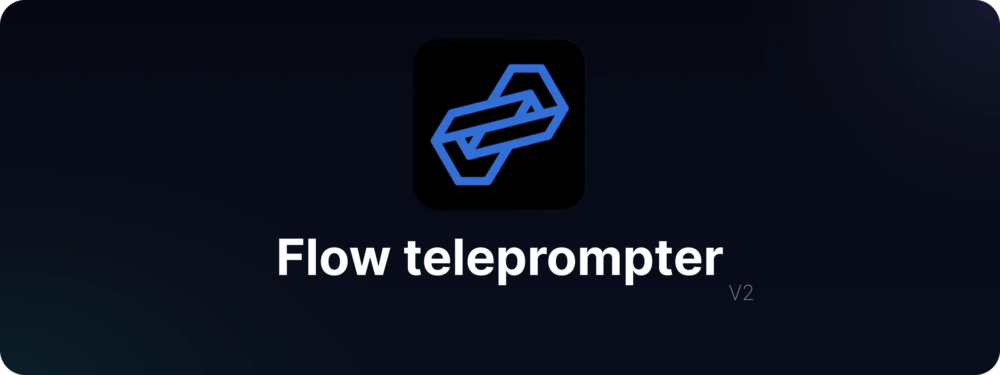
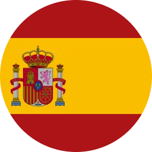
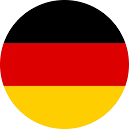
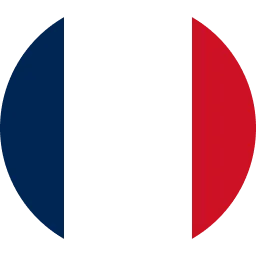
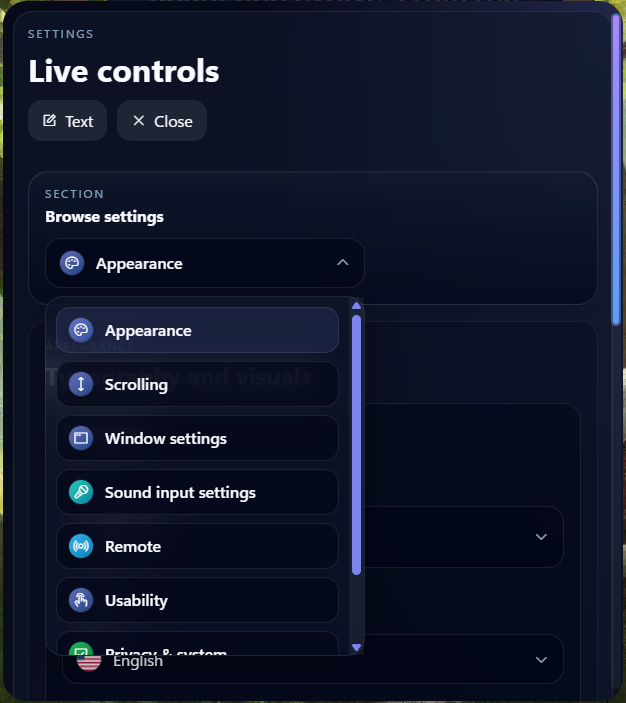
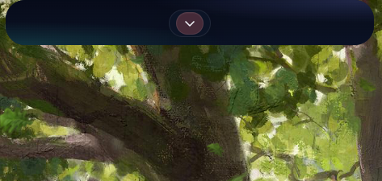

<!--
  Flow - A high-performance teleprompter for Windows.
  Copyright (C) 2026 Waled Alturkmani (LumoRez07)

  This program is free software: you can redistribute it and/or modify
  it under the terms of the GNU General Public License as published by
  the Free Software Foundation, either version 3 of the License, or
  (at your option) any later version.
-->

<div align="center">

<p align="center">
  
</p>

<p align="center">
  <span style="display:inline-block; margin: 0 10px; text-align: center;">
    <a href="README.md" style="text-decoration:none;">
      <br />
      <sub><b>English</b></sub>
    </a>
  </span>
  <span style="display:inline-block; margin: 0 10px; text-align: center;">
    <a href="README.es.md" style="text-decoration:none;">
      <br />
      <sub><b>Español</b></sub>
    </a>
  </span>
  <span style="display:inline-block; margin: 0 10px; text-align: center;">
    <a href="README.tr.md" style="text-decoration:none;">
      <br />
      <sub><b>Türkçe</b></sub>
    </a>
  </span>
  <span style="display:inline-block; margin: 0 10px; text-align: center;">
    <a href="README.ar.md" style="text-decoration:none;">
      <br />
      <sub><b>العربية</b></sub>
    </a>
  </span>
  <span style="display:inline-block; margin: 0 10px; text-align: center;">
    <a href="README.de.md" style="text-decoration:none;">
      <br />
      <sub><b>Deutsch</b></sub>
    </a>
  </span>
  <span style="display:inline-block; margin: 0 10px; text-align: center;">
    <a href="README.fr.md" style="text-decoration:none;">
      <br />
      <sub><b>Français</b></sub>
    </a>
  </span>
  <span style="display:inline-block; margin: 0 10px; text-align: center;">
    <a href="README.pt.md" style="text-decoration:none;">
      <br />
      <sub><b>Português</b></sub>
    </a>
  </span>
  <span style="display:inline-block; margin: 0 10px; text-align: center;">
    <br />
    <sub><b>Suomi</b></sub>
  </span>
</p>

<p align="center">
  <a href="https://github.com/LumoRez07/flow/releases" target="_blank">
    
  </a>
  <a href="https://github.com/LumoRez07/flow/releases" target="_blank">
    
  </a>
  <a href="https://sourceforge.net/projects/flowteleprompter/files/latest/download">
    
  </a>
  
  
  
</p>

<p align="center">
  <strong>Kevyt ja suorituskykyinen teleprompteri Windowsille, rakennettu Rustilla ja Taurilla.</strong>
</p>

<p align="center">
  Harkitse tähden antamista tälle repositoriolle, jos siitä on sinulle apua! ⭐
</p>

<p align="center">
  <a href="https://www.ghacks.net/de/2026/05/28/flow-teleprompter-windows-voice-tracking/" target="_blank">
    
  </a>
</p>

## Flow on saatavilla
<div align="center">
  <a href="https://sourceforge.net/p/flowteleprompter/">
    
  </a>
  <a href="https://apps.microsoft.com/detail/9p1fvfhwpmqr?mode=direct">
    
  </a>
  <br>
</div>

</div>

---

<p align="center">
  
</p>

- Viisi toistotilaa: korostus (highlight), vieritys (scroll), rivi (line), nuoli (arrow) ja puheenseuranta (voice tracking).
- Paikallislähtöinen käsikirjoitusten tallennus ja asetusten säilyminen (local-first).
- Erillinen äänitulon säätö laitevalinnalla, reaaliaikaisella seurannalla, kohinaportilla (noise gate) ja vahvistuksen säädöllä (gain).
- Koko sovelluksen laajuinen ääniohjaus lokalisoiduilla herätysilmauksilla ja joustavalla tunnistuksella.
- Vosk-puhemallit sisäänrakennetulla englannin kielellä sekä ladattavalla suomen, turkin, arabian, saksan, ranskan, espanjan ja portugalin tuella.
- Vihjekortit (cue cards) laskentalaskentatauolla ja automaattisella jatkamisella.
- Sisäänrakennettu käsikirjoituseditori muotoilutyökaluilla, sanamäärälaskurilla ja arvioidulla lukuajan näytöllä.
- Etäviestintätoiminto saapuneiden viestien tarkastelulla, pikayhdistettävillä QR-linkeillä ja lähettäjäpuolen vastaustilapäivityksillä.
- Reaaliaikainen tekstinmuokkaus, jonka avulla useat vieraat voivat liittyä ja muokata käsikirjoitusta samanaikaisesti yksityisen selainhuoneen kautta.
- Valinnainen Groq-pohjainen tekoälytekstin luonti ja uudelleenkirjoitus.
- Aina päällimmäisenä pysyvä (always-on-top) Windows-peittokuva läpiklikkaus- (click-through) ja kaappauksenestovaihtoehdoilla (capture-protection).
- Virallinen Tauri-päivittäjä sovelluksen sisäisillä tarkistuksilla, asennushallinnalla ja allekirjoitettujen Windows-julkaisujen syötteillä.

---

<p align="center">
  
</p>

### 1. Viestin syöttö (Message Injection)
https://github.com/user-attachments/assets/5e6a4fd1-5084-4e33-b56e-0142c2ad83ce

### 2. Reaaliaikainen muokkaus (Realtime Editing)
https://github.com/user-attachments/assets/653988f9-03f1-40ad-95b8-04339356cb07

---

<p align="center">
  
</p>

<div align="center">
  <h3>Teleprompterin päänäkymä</h3>
  
  
  
  <br><br>
  
  <h3>Tekstieditori ja sisäänrakennettu tekoälyavustaja</h3>
  
  

  <br><br>

  <h3>Asetukset ja kompaktinäkymä</h3>
  
  
</div>

---

<p align="center">
  
</p>

- **Käsikirjoituskirjasto ja -hallinta**: Sisäänrakennettu käsikirjoitusten hallintatyökalu useiden tekstien tallentamiseen, järjestämiseen, hakemiseen ja vaihtamiseen välittömästi sekä nopea tiedostojen tuontitoiminto.<br><br>
- **Osionavigaattori ja edistymisen seuranta**: Uudet osiotunnisteet ja visuaaliset virstanpylväät pitkien tekstien jakamiseen selkeisiin osiin, mahdollistaen nopean siirtymisen osiosta toiseen ja reaaliaikaisen edistymisen seurannan lukemisen aikana.<br><br>
- **Modulaarinen koodipohja**: Ydintoimintojen uudelleenjärjestely suorituskykyiseen modulaariseen arkkitehtuuriin nopeampaa latautumista ja vakaata toimintaa varten.<br><br>
- **Aloitusruutu (Splash Screen)**: Tyylikäs käynnistysruutu pehmeällä häivytyksellä (crossfade), joka poistaa ikkunan välkkymisen käynnistyksen yhteydessä.<br><br>
- **Moninäyttö- ja DPI-korjaukset**: Parannettu ikkunoiden kohdistus, koordinaattitarkkuus ja skaalaus usean näytön ja sekalaisten DPI-arvojen ympäristöissä.<br><br>

---

<p align="center">
  
</p>

- [x] Ydinarkkitehtuurin uudelleenkirjoitus Tauri + Rust -teknologioilla
- [x] Näkymätön peittokuva näytönjakoon, esityksiin ja videopuheluihin
- [x] Microsoft Store -sertifiointi ja julkaisu
- [x] Siirtyminen Cloudflare-infrastruktuuriin
- [x] v2.0.0: Frontendin JavaScript-moduulien uudelleenjärjestely ja suorituskykyparannukset
- [x] v2.0.0: Free/Pro-versioiden erottelulogiikan toteutus
- [ ] v2.1.0: Verkkolaskeutumissivun ja etäohjausasiakkaan parannukset
- [ ] v2.2.0+: Päätetään myöhemmin

---

<p align="center">
  
</p>

1. Lataa uusin versio [Microsoft Storesta](https://apps.microsoft.com/detail/9p1fvfhwpmqr?mode=direct) tai [GitHub Releases -sivulta](https://github.com/LumoRez07/flow/releases);
2. Suorita `.exe`- tai `.msi`-asennusohjelma;
3. Käynnistä Flow ja aloita esityksesi.

---

## Kehitys

Vaatimukset:
- Node.js
- Rust
- Taurin edellytykset Windowsille

Suorita paikallisesti:

```bash
npm install
npm run tauri dev
```

Käännä (Build):

```bash
npm run tauri build
```

Käännöksen tuloste:

```text
src-tauri/target/release
src-tauri/target/release/bundle
```

### Allekirjoitettu päivittäjän julkaisu

Jotta voit luoda Windows-julkaisun, joka on valmis GitHub Releases -julkaisuun ja Flow'n sovelluksen sisäiseen päivittäjään, aseta päivittäjän allekirjoitusavain ympäristömuuttujiin ennen kääntämistä:

```powershell
$env:TAURI_SIGNING_PRIVATE_KEY = Get-Content -Raw "$HOME\.tauri\flow-updater.key"
$env:TAURI_SIGNING_PRIVATE_KEY_PASSWORD = "<your-updater-key-password>"
npm run tauri build
```

Julkaise nämä tiedostot hakemistosta `src-tauri/target/release/bundle` GitHub-julkaisuun:

- `msi/flow_2.0.0_x64_en-US.msi`
- `latest.json`

`.sig`-tiedosto luodaan MSI-tiedoston rinnalle viitteeksi, kun taas `latest.json` on sovelluksen käyttämä päivityssyöte.

---

## Tietosuoja

- Suurin osa tiedoista tallennetaan paikallisesti laitteellesi.
- Puheenseuranta toimii paikallisesti Vosk-malleilla.
- Groq-pyynnöt lähetetään vain silloin, kun tekoälyominaisuuksia käytetään aktiivisesti.
- Katso nykyinen tietosuojakäytäntö tiedostosta [privacy-policy.md](privacy-policy.md).

---

## Kiitokset

Erityiskiitos käyttäjille [@emanschigames](https://www.instagram.com/emanschigames/?hl=en) ja [@nour690](https://github.com/nour690) Flow Teleprompterin tukemisesta silloin, kun sitä eniten tarvittiin. Vaikka ele olisi ollut pieni, se merkitsi paljon ja sitä arvostetaan vilpittömästi.


---

## Lisenssi

Tämä projekti on lisensoitu GPL-3.0-or-later -lisenssillä. Katso [LICENSE](LICENSE).

---

## Tähtihistoria (Star History)

<a href="https://www.star-history.com/?repos=LumoRez07%2FFlow&type=date&legend=top-left">
 <picture>
   <source media="(prefers-color-scheme: dark)" srcset="https://api.star-history.com/chart?repos=LumoRez07/Flow&type=date&theme=dark&legend=top-left" />
   <source media="(prefers-color-scheme: light)" srcset="https://api.star-history.com/chart?repos=LumoRez07/Flow&type=date&legend=top-left" />
   
 </picture>
</a>
