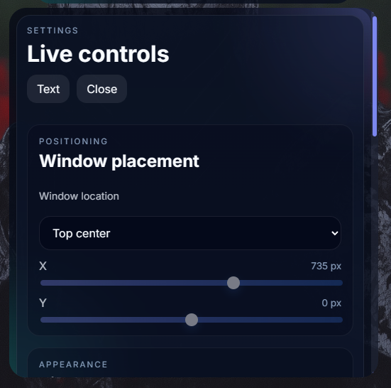

<p align="center">
  
</p>

<h1 align="center">Flow</h1>

<p align="center">
  A modern, high-performance teleprompter for Windows — built for clarity, control, and minimal overhead.
</p>

<p align="center">
  <strong>v1.0.0</strong> · Tauri v2 · Rust Core · Vanilla JS UI · Windows-first
</p>

<p align="center">
  
  
  
  
  
</p>

<p align="center">
  
  
  
  
</p>

---

## Quick Links

- [English](#english)
- [Türkçe](#türkçe)
- [العربية](#العربية)
- [Français](#français)
- [Deutsch](#deutsch)
- [Español](#español)

---

## English

## 📸 Preview

<p align="center">
  
</p>

<p align="center">
  
  
</p>

<p align="center">
  
  
  
</p>

---

## 🚀 Why Flow?

Most teleprompters are either bloated or too minimal.  
Flow is designed to stay fast, focused, and out of your way.

- ⚡ Lightweight and responsive  
- 🎯 Distraction-free reading  
- 🎤 Voice-driven control (`Hey Flow`)  
- 🧠 Optional AI-assisted scripting  
- 📡 Remote message injection  

---


## 📦 Installation

Download the latest version from the **Releases** section on GitHub.

---

## 🛠 Development

### Requirements
- Node.js  
- Rust  
- Tauri prerequisites (Windows)  

### Run
```bash
npm install
npm run tauri dev
```

### Build
```bash
npm run tauri build
```

Output:
```
src-tauri/target/release
src-tauri/target/release/bundle
```

---

## ✨ Features

### Playback
- Highlight, scroll, line, arrow, and voice tracking modes  
- Adjustable speed (WPM-based)  
- Keyboard shortcuts and floating controls  

### Writing & Editing
- Dedicated script editor  
- Bold, italic, underline, and highlight support  
- Word count and estimated reading time  

### Voice & AI
- Wake phrase: `Hey Flow`  
- Voice commands (pause, resume, navigation)  
- Optional Groq-powered drafting and rewriting  

### `Hey Flow` Commands
- `Hey Flow play`
- `Hey Flow pause`
- `Hey Flow continue`
- `Hey Flow stop`
- `Hey Flow up`
- `Hey Flow down`
- `Hey Flow hide`
- `Hey Flow show`
- `Hey Flow expand`

### Remote Messaging
- Cloud relay for external input  
- Inbox review before inserting text  

### System Integration
- Windows tray behavior  
- Click-through support  
- Capture protection  
- Theme, typography, and transparency controls  

---

## ⚠️ Remote Messaging Note

Flow’s remote messaging system is still evolving.  
Heavy usage may lead to temporary limits until the infrastructure is expanded.

---

## 🔐 Notes

- Optimized for Windows  
- AI features require a Groq API key  
- API keys are stored locally  

---

## Türkçe

## 🚀 Neden Flow?

Birçok teleprompter ya gereğinden ağır ya da fazla sınırlıdır.  
Flow hızlı, odaklı ve sizi yormayan bir deneyim sunmak için tasarlandı.

- ⚡ Hafif ve hızlı  
- 🎯 Dikkat dağıtmayan okuma deneyimi  
- 🎤 Sesle kontrol (`Hey Flow`)  
- 🧠 İsteğe bağlı yapay zekâ destekli metin yardımı  
- 📡 Uzak mesaj gönderme desteği  

---

## 📦 Kurulum

En güncel sürümü GitHub üzerindeki **Releases** bölümünden indirin.

---

## 🛠 Geliştirme

### Gereksinimler
- Node.js  
- Rust  
- Tauri önkoşulları (Windows)  

### Çalıştırma
```bash
npm install
npm run tauri dev
```

### Build
```bash
npm run tauri build
```

Çıktı:
```
src-tauri/target/release
src-tauri/target/release/bundle
```

---

## ✨ Özellikler

### Oynatma
- Vurgu, kaydırma, satır, ok ve ses takibi modları  
- WPM tabanlı hız ayarı  
- Klavye kısayolları ve yüzen kontroller  

### Yazma ve Düzenleme
- Ayrı metin düzenleyici  
- Kalın, italik, altı çizili ve vurgu desteği  
- Kelime sayısı ve tahmini okuma süresi  

### Ses ve Yapay Zekâ
- Uyandırma ifadesi: `Hey Flow`  
- Sesli komutlar (duraklat, devam et, gezinme)  
- İsteğe bağlı Groq destekli yazım ve yeniden yazım  

### `Hey Flow` Komutları
- `Hey Flow play`
- `Hey Flow pause`
- `Hey Flow continue`
- `Hey Flow stop`
- `Hey Flow up`
- `Hey Flow down`
- `Hey Flow hide`
- `Hey Flow show`
- `Hey Flow expand`

### Uzak Mesajlaşma
- Harici giriş için bulut aktarma sistemi  
- Metni eklemeden önce gelen kutusu incelemesi  

### Sistem Entegrasyonu
- Windows sistem tepsisi davranışı  
- Tıklama geçiş desteği  
- Yakalama koruması  
- Tema, tipografi ve şeffaflık kontrolleri  

---

## ⚠️ Uzak Mesajlaşma Notu

Flow’un uzak mesajlaşma sistemi hâlâ gelişmektedir.  
Altyapı genişletilene kadar yoğun kullanım geçici sınırlamalara yol açabilir.

---

## 🔐 Notlar

- Windows için optimize edilmiştir  
- Yapay zekâ özellikleri için Groq API anahtarı gerekir  
- API anahtarları yerel olarak saklanır  

---

## العربية

## 🚀 لماذا Flow؟

معظم تطبيقات التلقين إما ثقيلة جدًا أو محدودة جدًا.  
تم تصميم Flow ليكون سريعًا وواضحًا ولا يعيق سير عملك.

- ⚡ خفيف وسريع  
- 🎯 قراءة بدون تشتيت  
- 🎤 تحكم صوتي عبر (`Hey Flow`)  
- 🧠 كتابة مدعومة بالذكاء الاصطناعي بشكل اختياري  
- 📡 إدخال الرسائل عن بُعد  

---

## 📦 التثبيت

قم بتنزيل أحدث إصدار من قسم **Releases** على GitHub.

---

## 🛠 التطوير

### المتطلبات
- Node.js  
- Rust  
- متطلبات Tauri على ويندوز  

### التشغيل
```bash
npm install
npm run tauri dev
```

### البناء
```bash
npm run tauri build
```

المخرجات:
```
src-tauri/target/release
src-tauri/target/release/bundle
```

---

## ✨ الميزات

### التشغيل
- أوضاع التمييز والتمرير والسطر والسهم وتتبع الصوت  
- سرعة قابلة للتعديل حسب الكلمات في الدقيقة  
- اختصارات لوحة المفاتيح وعناصر تحكم عائمة  

### الكتابة والتحرير
- محرر نصوص مخصص  
- دعم الغامق والمائل والتسطير والتمييز  
- عدد الكلمات ووقت القراءة المتوقع  

### الصوت والذكاء الاصطناعي
- عبارة التنبيه: `Hey Flow`  
- أوامر صوتية مثل الإيقاف المؤقت والمتابعة والتنقل  
- كتابة وإعادة صياغة اختيارية عبر Groq  

### أوامر `Hey Flow`
- `Hey Flow play`
- `Hey Flow pause`
- `Hey Flow continue`
- `Hey Flow stop`
- `Hey Flow up`
- `Hey Flow down`
- `Hey Flow hide`
- `Hey Flow show`
- `Hey Flow expand`

### الرسائل عن بُعد
- ترحيل سحابي للإدخال الخارجي  
- مراجعة الرسائل قبل إضافتها إلى النص  

### تكامل النظام
- سلوك شريط النظام في ويندوز  
- دعم النقر الشفاف  
- الحماية من الالتقاط  
- عناصر تحكم للسمات والخطوط والشفافية  

---

## ⚠️ ملاحظة حول الرسائل عن بُعد

نظام الرسائل عن بُعد في Flow ما زال في طور التطوير.  
قد يؤدي الاستخدام الكثيف إلى حدود مؤقتة إلى أن يتم توسيع البنية التحتية.

---

## 🔐 ملاحظات

- مُحسّن لويندوز  
- ميزات الذكاء الاصطناعي تتطلب مفتاح Groq API  
- يتم تخزين مفاتيح API محليًا  

---

## Français

## 🚀 Pourquoi Flow ?

La plupart des téléprompteurs sont soit trop lourds, soit trop limités.  
Flow est conçu pour rester rapide, clair et agréable à utiliser.

- ⚡ Léger et réactif  
- 🎯 Lecture sans distraction  
- 🎤 Contrôle vocal avec (`Hey Flow`)  
- 🧠 Assistance IA optionnelle pour l’écriture  
- 📡 Injection de messages à distance  

---

## 📦 Installation

Téléchargez la dernière version depuis la section **Releases** sur GitHub.

---

## 🛠 Développement

### Prérequis
- Node.js  
- Rust  
- Prérequis Tauri (Windows)  

### Lancement
```bash
npm install
npm run tauri dev
```

### Build
```bash
npm run tauri build
```

Sortie :
```
src-tauri/target/release
src-tauri/target/release/bundle
```

---

## ✨ Fonctionnalités

### Lecture
- Modes surlignage, défilement, ligne, flèche et suivi vocal  
- Vitesse réglable en mots par minute  
- Raccourcis clavier et contrôles flottants  

### Écriture et édition
- Éditeur de script dédié  
- Prise en charge du gras, de l’italique, du soulignement et du surlignage  
- Compteur de mots et temps de lecture estimé  

### Voix et IA
- Phrase d’activation : `Hey Flow`  
- Commandes vocales (pause, reprise, navigation)  
- Rédaction et réécriture optionnelles avec Groq  

### Commandes `Hey Flow`
- `Hey Flow play`
- `Hey Flow pause`
- `Hey Flow continue`
- `Hey Flow stop`
- `Hey Flow up`
- `Hey Flow down`
- `Hey Flow hide`
- `Hey Flow show`
- `Hey Flow expand`

### Messagerie à distance
- Relais cloud pour les entrées externes  
- Vérification dans la boîte de réception avant insertion  

### Intégration système
- Comportement via la zone de notification Windows  
- Support du click-through  
- Protection contre la capture  
- Contrôles de thème, typographie et transparence  

---

## ⚠️ Note sur la messagerie à distance

Le système de messagerie à distance de Flow est encore en évolution.  
Une utilisation intensive peut entraîner des limitations temporaires tant que l’infrastructure n’a pas été étendue.

---

## 🔐 Notes

- Optimisé pour Windows  
- Les fonctions IA nécessitent une clé API Groq  
- Les clés API sont stockées localement  

---

## Deutsch

## 🚀 Warum Flow?

Die meisten Teleprompter sind entweder zu überladen oder zu eingeschränkt.  
Flow wurde entwickelt, um schnell, fokussiert und angenehm nutzbar zu bleiben.

- ⚡ Leicht und reaktionsschnell  
- 🎯 Ablenkungsfreies Lesen  
- 🎤 Sprachsteuerung mit (`Hey Flow`)  
- 🧠 Optionale KI-gestützte Texthilfe  
- 📡 Remote-Nachrichtenintegration  

---

## 📦 Installation

Lade die neueste Version aus dem Bereich **Releases** auf GitHub herunter.

---

## 🛠 Entwicklung

### Voraussetzungen
- Node.js  
- Rust  
- Tauri-Voraussetzungen (Windows)  

### Starten
```bash
npm install
npm run tauri dev
```

### Build
```bash
npm run tauri build
```

Ausgabe:
```
src-tauri/target/release
src-tauri/target/release/bundle
```

---

## ✨ Funktionen

### Wiedergabe
- Hervorhebungs-, Scroll-, Zeilen-, Pfeil- und Sprachverfolgungsmodi  
- Anpassbare Geschwindigkeit in WPM  
- Tastenkürzel und schwebende Steuerung  

### Schreiben und Bearbeiten
- Eigener Skripteditor  
- Unterstützung für Fett, Kursiv, Unterstrichen und Hervorhebungen  
- Wortanzahl und geschätzte Lesezeit  

### Sprache und KI
- Aktivierungsphrase: `Hey Flow`  
- Sprachbefehle (Pause, Fortsetzen, Navigation)  
- Optionale Groq-gestützte Erstellung und Umschreibung  

### `Hey Flow` Befehle
- `Hey Flow play`
- `Hey Flow pause`
- `Hey Flow continue`
- `Hey Flow stop`
- `Hey Flow up`
- `Hey Flow down`
- `Hey Flow hide`
- `Hey Flow show`
- `Hey Flow expand`

### Remote Messaging
- Cloud-Relay für externe Eingaben  
- Prüfung im Posteingang vor dem Einfügen  

### Systemintegration
- Windows-Infobereich-Verhalten  
- Click-through-Unterstützung  
- Schutz vor Bildschirmaufnahme  
- Theme-, Typografie- und Transparenzsteuerung  

---

## ⚠️ Hinweis zur Remote-Messaging-Funktion

Das Remote-Messaging-System von Flow befindet sich noch im Ausbau.  
Starke Nutzung kann vorübergehend zu Einschränkungen führen, bis die Infrastruktur erweitert wurde.

---

## 🔐 Hinweise

- Für Windows optimiert  
- KI-Funktionen benötigen einen Groq-API-Schlüssel  
- API-Schlüssel werden lokal gespeichert  

---

## Español

## 🚀 ¿Por qué Flow?

La mayoría de los teleprompters son demasiado pesados o demasiado limitados.  
Flow está diseñado para mantenerse rápido, enfocado y fuera de tu camino.

- ⚡ Ligero y ágil  
- 🎯 Lectura sin distracciones  
- 🎤 Control por voz con (`Hey Flow`)  
- 🧠 Asistencia opcional con IA para escritura  
- 📡 Inyección de mensajes remotos  

---

## 📦 Instalación

Descarga la versión más reciente desde la sección **Releases** en GitHub.

---

## 🛠 Desarrollo

### Requisitos
- Node.js  
- Rust  
- Requisitos de Tauri (Windows)  

### Ejecutar
```bash
npm install
npm run tauri dev
```

### Build
```bash
npm run tauri build
```

Salida:
```
src-tauri/target/release
src-tauri/target/release/bundle
```

---

## ✨ Funciones

### Reproducción
- Modos de resaltado, desplazamiento, línea, flecha y seguimiento por voz  
- Velocidad ajustable en palabras por minuto  
- Atajos de teclado y controles flotantes  

### Escritura y edición
- Editor de guiones dedicado  
- Soporte para negrita, cursiva, subrayado y resaltado  
- Conteo de palabras y tiempo estimado de lectura  

### Voz e IA
- Frase de activación: `Hey Flow`  
- Comandos de voz (pausa, continuar, navegación)  
- Redacción y reescritura opcional con Groq  

### Comandos `Hey Flow`
- `Hey Flow play`
- `Hey Flow pause`
- `Hey Flow continue`
- `Hey Flow stop`
- `Hey Flow up`
- `Hey Flow down`
- `Hey Flow hide`
- `Hey Flow show`
- `Hey Flow expand`

### Mensajería remota
- Relay en la nube para entradas externas  
- Revisión en bandeja antes de insertar texto  

### Integración del sistema
- Comportamiento en la bandeja de Windows  
- Soporte de click-through  
- Protección contra captura  
- Controles de tema, tipografía y transparencia  

---

## ⚠️ Nota sobre la mensajería remota

El sistema de mensajería remota de Flow todavía está en evolución.  
Un uso intensivo puede provocar límites temporales hasta que la infraestructura sea ampliada.

---

## 🔐 Notas

- Optimizado para Windows  
- Las funciones de IA requieren una clave API de Groq  
- Las claves API se almacenan localmente  
